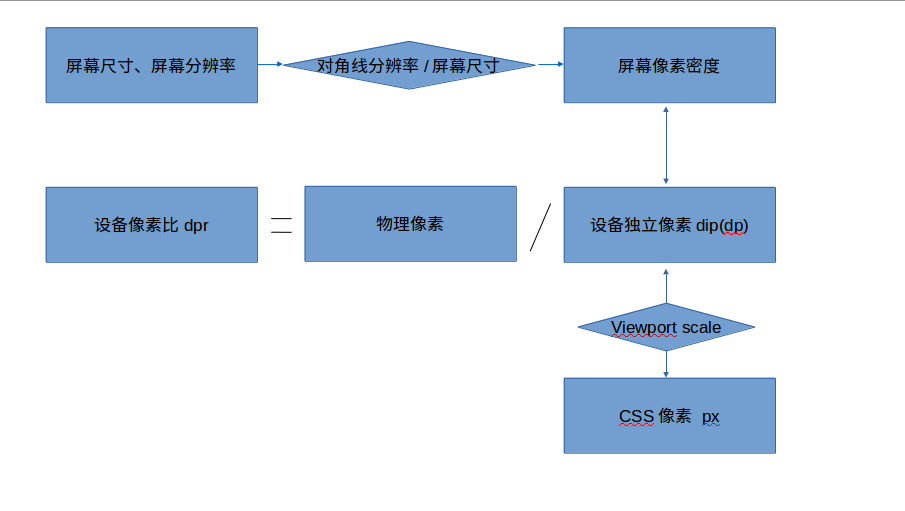
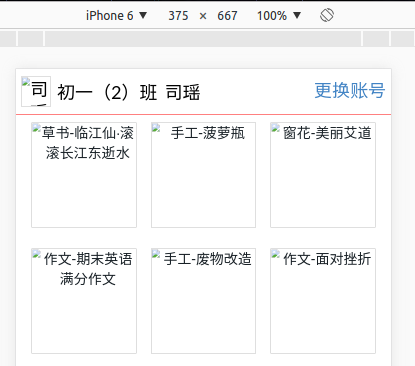
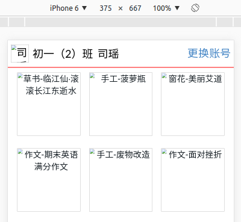
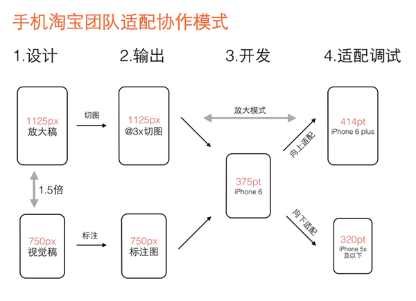

# 移动端适配方案对比
## 前言与目录 
移动端Web页面，即常说的H5页面、手机页面、webview页面等。

手机设备屏幕尺寸不一，做移动端的Web页面，需要考虑在安卓/IOS的各种尺寸设备上的兼容，这里总结的是针对移动端设备的页面，设计与前端实现怎样做能更好地适配不同屏幕宽度的移动设备。

## 适配的目标 
引用一文章的描述：
> 在不同尺寸的手机设备上，页面“相对性的达到合理的展示（自适应）”或者“保持统一效果的等比缩放（看起来差不多）”。

## 本文目录
- 概念理解
- 实现方式
- 小结

## 概念理解 
在做适配之前，需要先理解一些概念。对于不理解的地方，可以搜索更多文章看看，本文总结的也是摘抄了其他文章的描述，本文末有附相关链接。

### viewport视口 
viewport是严格的等于浏览器的窗口。```viewport```与跟```viewport```有关的```meta```标签的关系，详细建议读一读这篇文章：[移动前端开发之viewport的深入理解](https://www.cnblogs.com/2050/p/3877280.html)，```viewport```与布局的关系，可以看下这篇文章：[在移动浏览器中使用viewport元标签控制布局](https://developer.mozilla.org/zh-CN/docs/Mobile/Viewport_meta_tag)

> ```visual viewport``` 可见视口  屏幕宽度
> ```layout viewport``` 布局视口  DOM宽度
> ```ideal viewport``` 理想适口：使布局视口就是可见视口
> 设备宽度(```visual viewport```)与DOM宽度```(layout viewport), scale```的关系为：
>- ```（visual viewport）= （layout viewport）* scale ```

> 获取```屏幕宽度(visual viewport)```的尺寸：```window. innerWidth/Height```。
> 获取```DOM宽度(layout viewport)```的尺寸：```document. documentElement. clientWidth/Height```。

**设置理想视口：**把默认的layout viewport的宽度设为移动设备的屏幕宽度，得到理想视口```(ideal viewport)```: 
```
<meta name="viewport" content="width=device-width,initial-scale=1">
```

### 物理像素(physical pixel)
物理像素又被称为设备像素，他是显示设备中一个最微小的物理部件。每个像素可以根据操作系统设置自己的颜色和亮度。所谓的一倍屏、二倍屏(Retina)、三倍屏，指的是设备以多少物理像素来显示一个CSS像素，也就是说，多倍屏以更多更精细的物理像素点来显示一个CSS像素点，在普通屏幕下1个CSS像素对应1个物理像素，而在Retina屏幕下，1个CSS像素对应的却是4个物理像素。关于这个概念，看一张"田"字示意图就会清晰了。

### CSS像素
CSS像素是一个抽像的单位，主要使用在浏览器上，用来精确度量Web页面上的内容。一般情况之下，CSS像素称为与设备无关的像素(device-independent pixel)，简称DIPs。CSS像素顾名思义就是我们写CSS时所用的像素。

### 设备像素比dpr(device pixel ratio) 
设备像素比简称为dpr，其定义了物理像素和设备独立像素的对应关系。它的值可以按下面的公式计算得到：

设备像素比 ＝ 物理像素 / 设备独立像素

在Retina屏的iphone上，devicePixelRatio的值为2，也就是说1个css像素相当于2个物理像素。通常所说的二倍屏(retina)的dpr是2, 三倍屏是3。

> viewport中的scale和dpr是倒数关系。
> 获取当前设备的dpr：
>- ```JavaScript: window.devicePixelRatio```。
>-  ```CSS: -webkit-device-pixel-ratio,  -webkit-min-device-pixel-ratio, -webkit-max-device-pixel-ratio```。不同dpr的设备，可根据此做一些样式适配(这里只针对webkit内核的浏览器和webview)。

### 设备独立像素dip或dp
dip或dp,（device independent pixels，设备独立像素）与屏幕密度有关。dip可以用来辅助区分视网膜设备还是非视网膜设备。

> 安卓设备根据屏幕像素密度可分为ldpi、mdpi、hdpi、xhdpi等不同的等级。规定以160dpi为基准，1dp=1px。如果密度是320dpi，则1dp=2px，以此类推。
> IOS设备：从IPhone4开始为Retina屏
>- CSS像素与设备独立像素之间的关系依赖于当前的缩放等级。

### 屏幕像素密度PPI(pixel per inch) 
屏幕像素密度是指一个设备表面上存在的像素数量，它通常以每英寸有多少像素来计算(PPI)。屏幕像素密度与屏幕尺寸和屏幕分辨率有关，在单一变化条件下，屏幕尺寸越小、分辨率越高，像素密度越大，反之越小。
> 屏幕密度 = 对角线分辨率/屏幕尺寸

### 概念关系图

下面这些图有助于你对以上所讲概念的理解。

```
屏幕尺寸、屏幕分辨率-->对角线分辨率/屏幕尺寸-->屏幕像素密度PPI
                                             |
              设备像素比dpr = 物理像素 / 设备独立像素dip(dp)
                                             |
                                       viewport: scale
                                             |
                                          CSS像素px
```




## 前端实现相关方式
下面大致列下前端在实现适配上常采用的方式。

### viewport
#### 设置理想视口
```
<meta name="viewport" content="width=width=device-width, user-scalable=no, initial-scale=1.0, maximum-scale=1.0, minimum-scale=1.0">
```
设置理想视口(页面不缩放，禁止用户缩放)，使得DOM宽度(layout viewport)与屏幕宽度(visual viewport)一样大,DOM文档主宽度即为屏幕宽度。1个CSS像素(1px)由多少设备像素显示由具体设备而不同。

#### 动态设置视口缩放为1/dpr ####
对于安卓，所有设备缩放设为1,对于IOS，根据dpr不同，设置其缩放为dpr倒数。**设置页面缩放可以使得1个CSS像素(1px)由1个设备像素来显示，从而提高显示精度；因此，设置1/dpr的缩放视口，可以画出1px的边框。**

不管页面中有没有设置viewport，若无，则设置，若有，则改写，设置其scale为1/dpr。
```js
(function (doc, win) {
  var docEl = win.document.documentElement;
  var resizeEvt = 'orientationchange' in window ? 'orientationchange' : 'resize';
  var metaEl = doc.querySelector('meta[name="viewport"]');
  var dpr = 0;
  var scale = 0;

  // 对iOS设备进行dpr的判断，对于Android系列，始终认为其dpr为1
  if (!dpr && !scale) {
    var isAndroid = win.navigator.appVersion.match(/android/gi);
    var isIPhone = win.navigator.appVersion.match(/[iphone|ipad]/gi);
    var devicePixelRatio = win.devicePixelRatio;

    if(isIPhone) {   //IOS
      dpr = devicePixelRatio;
    } else {   //安卓
      drp = 1;
    }
    
    scale = 1 / dpr;
  }

  /**
    * ================================================
    *   设置data-dpr和viewport
    × ================================================
    */

  docEl.setAttribute('data-dpr', dpr);
  // 动态改写meta:viewport标签
  if (!metaEl) {
    metaEl = doc.createElement('meta');
    metaEl.setAttribute('name', 'viewport');
    metaEl.setAttribute('content', 'width=device-width, initial-scale=' + scale + ', maximum-scale=' + scale + ', minimum-scale=' + scale + ', user-scalable=no');
    document.documentElement.firstElementChild.appendChild(metaEl);
  } else {
    metaEl.setAttribute('content', 'width=device-width, initial-scale=' + scale + ', maximum-scale=' + scale + ', minimum-scale=' + scale + ', user-scalable=no');
  }
})(document, window);

```

#### px单位的适配
设置动态缩放视口后，在iPhone6上，缩放为0.5，即CSS像素2px最终显示效果为1px，而在scale=1的设备，CSS像素1px显示效果为1px，那么，为了达到显示效果一致，以px为单位的元素(比如字体大小)，其样式应有适配不同dpr的版本，因此，在动态设置```viewport: scale```的时候，同时在html根元素上加上```data-dpr=[dpr]```，**但是这种方式还是不够，如果dpr为2，3之外的其他数值，px就没办法适配到。因此我会选择都用rem为单位进行适配。**
样式示例：
```css
.p {
    font-size: 14px;

  [data-dpr="2"] & {
    font-size: 14px * 2;
  }

  [data-dpr="3"] & {
    font-size: 14px * 3;
  }
}
```
为写样式方便，可以借助sass的mixin写代码片段：

```scss
// 适配dpr的字体大小
@mixin font-dpr($font-size){
  font-size: $font-size;

  [data-dpr="2"] & {
      font-size: $font-size * 2;
  }

  [data-dpr="3"] & {
      font-size: $font-size * 3;
  }
}
@mixin px-dpr($property, $px) {
  #{$property}: $px;

  [data-dpr="2"] & {
    #{$property}: $px * 2;
  }

  [data-dpr="3"] & {
    #{$property}: $px * 3;
  }
}

// 使用
@include font-dpr(14px);
@include px-dpr(width, 40px); @include px-dpr(height, 40px);
```

#### 设置缩放视口与设置理想视口有什么不同 
问题：viewport设为理想视口(scale=1)，基本已经满足适配，为什么要动态设置viewport缩放?
原因：iPhone6为例，dpr为2，缩放设为0.5，则DOM宽度为750，缩放后显示刚好为屏幕宽度375，而总的CSS像素其实是750，与设备像素一致，这样1px的CSS像素，占用的物理像素也是1；而viewport设置缩放为1的理想视口情况下，DOM宽度为375，显示也刚好是屏幕宽度，然而1px的CSS像素，占用的物理像素是2。这样说来，这样设置可以实现1px的线条在二倍屏的显示。因为：** CSS像素与设备像素的关系依赖于屏幕缩放。 **
验证：设备：iPhone6, 
在scale=0.5时，1px边框显示效果;
在scale=1.0时，1px边框显示效果;
在scale=0.5时，2px边框显示效果;







通过对比后发现，在scale=0.5时，1px的线比scale=1.0要细，即** 不同dpr的设备用不同伸缩比，可以实现在多倍屏设备上显示1px设备独立像素的线条 **，这也就解决了1px线条的显示问题。


### rem(一个CSS单位)
> 定义：font size of the root element.

这个单位的定义和em类似，不同的是em是相对于父元素，而rem是相对于根元素。rem定义是根元素的font-size, 以rem为单位，其数值与px的关系，需相对于根元素<html>的font-size计算，比如，设置根元素font-size=16px, 则表示1rem=16px。关于rem更多的解读，建议可以阅读本文末附的腾讯一团队的文章《web app变革之rem》。

根据这个特点，可以根据设备宽度动态设置根元素的font-size，使得以rem为单位的元素在不同终端上以相对一致的视觉效果呈现。

选取一个设备宽度作为基准，设置其根元素大小，其他设备根据此比例计算其根元素大小。比如使得iPhone6根元素font-size=16px。

|  设 备  |   设备宽度   | 根元素font-size/px |  宽度/rem  |
| :-----: | :--------: | :---------------: | :--------: |
| iPhone5 |  320       |  js计算所得        |  --        |
| iPhone6 |  375       |  16               |  23.4375   |
| i6 Plus |  414       |  js计算所得        |  --        |
|  -      |  360       |  js计算所得        |  --        |

> 根元素fontSize公式：```width/fontSize = baseWidth/baseFontSize```

> 其中，```baseWidth, baseFontSize```是选为基准的设备宽度及其根元素大小，```width, fontSize```为所求设备的宽度及其根元素大小

#### 动态设置根元素fontSize ####
```js
(function (doc, win) {
  var docEl = win.document.documentElement;
  var resizeEvt = 'orientationchange' in window ? 'orientationchange' : 'resize';
  /**
    * ================================================
    *   设置根元素font-size
    * 当设备宽度为375(iPhone6)时，根元素font-size=16px; 
    × ================================================
    */
  var refreshRem = function () {
    var clientWidth = win.innerWidth
                      || doc.documentElement.clientWidth
                      || doc.body.clientWidth;

    console.log(clientWidth)
    if (!clientWidth) return;
    var fz;
    var width = clientWidth;
    fz = 16 * width / 375;
    docEl.style.fontSize = fz + 'px';
  };

  if (!doc.addEventListener) return;
  win.addEventListener(resizeEvt, refreshRem, false);
  doc.addEventListener('DOMContentLoaded', refreshRem, false);
  refreshRem();

})(document, window);
```

#### rem计算(px2rem) ####
对于需要使用rem来适配不同屏幕的元素，使用rem来作为CSS单位，为了方便，可以借助sass写一个函数计算px转化为rem, 写样式时不必一直手动计算。sass函数的使用若不熟悉可看下[这篇文章：如何编写自定义Sass 函数](https://www.w3cplus.com/preprocessor/custom-sass-functions.html), 也可以使用sass的mixin来写，个人觉得用函数写更适合。

```scss
/* 
 * 此处 $base-font-size 具体数值根据设计图尺寸而定
 * flexible中设置的标准是【fontSize=16px, when 屏幕宽度=375】，因此，按此标准进行计算，
 * 若设计图为iPhone6(375*667)的二倍稿，则$base-font-size=32px
 *
 */ 
@function px2rem($px, $base-font-size: 32px) {
  @if (unitless($px)) {
    @warn "Assuming #{$px} to be in pixels, attempting to convert it into pixels for you";
    @return px2rem($px + 0px); // That may fail.
  } @else if (unit($px) == rem) {
    @return $px;
  }
  @return ($px / $base-font-size) * 1rem;
}

// 使用，eg:
font-size: px2rem(18px);

```

#### 问题思考 ####
我之前一直在想一个问题，选取哪个设备来做基准、屏幕宽度等分为多少比较合适，设计图给多大宽度的版本？被选取作为基准的设备，应当就是前端需要设计提供的设计图版本，这样可以避免一些尺寸上的纠缠，而等分为多少等分，除了考虑方便设计，是否需要考虑其他问题？对于根元素font-size没有手动设置的情况，1rem究竟等于多少？

> 了解到的一些事实：
>- 某些Android设备会丢掉 rem 小数部分（具体是哪些设备，搜到的文章中没有说），那么1rem对应的px少些，在这些安卓设备上显示误差就会较小，当然如果不存在会丢掉小数这个问题，这一说也就不必考虑了。
>- 未设置font-size情况下，1rem的大小具体看浏览器的实现，默认的根元素大小是font-size=16px
>- 目前一般会选取iPhone6作为基准，设计图便要iPhone6的二倍图
>- ** 当动态缩放视口为1/dpr, 计算所得的根元素fontSize也会跟着缩放，即若理想视口(scale=1), iPhone6根元素fontSize=16px; 若scale=0.5, iPhone6根元素fontSize=32px; 因此设置视口缩放应放于设置根元素fontSize之前。 **

### vm/vh:CSS单位 
```vw(view-width), vh(view-height)``` 这两个单位是CSS新增的单位，表示视区宽度/高度，** 视区总宽度为100vw, 总高度为100vh **。
> 视区指浏览器内部的可视区域大小：```window.innerWidth/Height```

## 其他问题 ##
### upsampling/downsampling ###
``` DownSampling: ```大图放入比图片尺寸小的容器中时，出现像素分割成就近色

不同scale显示同一图片基本无问题;
同一sacle，不同倍数图，存在色差(Downsampling)

关于这个我还不是很了解，暂时记一下。

## 手淘的实现方案 ##

本文记录的实现方案```viewport scale=1/dpr```即参考自淘宝的方案，详细介绍可以查看这篇文章：[使用Flexible实现手淘H5页面的终端适配](https://github.com/amfe/article/issues/17)

图解设计与前端协作方案：


方案关键点：
- 动态改写<meta name="viewport">标签
- 给<html>元素添加data-dpr属性，并且动态改写data-dpr的值
- 给<html>元素添加font-size属性，并且动态改写font-size的值

通过一段JS代码根据设备的屏幕宽度、dpr设置根元素的data-dpr和font-size, 这段JS代码要在所有资源加载之前执行，建议做内联处理。

各种元素(文本、图片)处理方案参考：
[图：怎样让你的网站适应视网膜分辨率](https://camo.githubusercontent.com/55960bfa1419eabdee47efdd2f863a9ab50b3203/687474703a2f2f7777772e773363706c75732e636f6d2f73697465732f64656661756c742f66696c65732f626c6f67732f3230313231322f726574696e612d7765622d31302e6a7067)

### px转rem的mixin ###

```scss
// 使用sass的混合宏
// 淘宝手淘的方案里，i6(375pt)屏幕宽度为10rem，即font-size=75px, scale=0.5 因设计图为二倍图，$base-font-size=75px
@mixin px2rem($property,$px-values,$baseline-px:16px,$support-for-ie:false){
    //Conver the baseline into rems
    $baseline-rem: $baseline-px / 1rem * 1;
    //Print the first line in pixel values
    @if $support-for-ie {
        #{$property}: $px-values;
    }
    //if there is only one (numeric) value, return the property/value line for it.
    @if type-of($px-values) == "number"{
        #{$property}: $px-values / $baseline-rem;
    }
    @else {
        //Create an empty list that we can dump values into
        $rem-values:();
        @each $value in $px-values{
            // If the value is zero or not a number, return it
            @if $value == 0 or type-of($value) != "number"{
                $rem-values: append($rem-values, $value / $baseline-rem);
            }
        }
        // Return the property and its list of converted values
        #{$property}: $rem-values;
    }
}
```
## 小结
- 适配不同屏幕宽度以及不同dpr，通过动态设置viewport(scale=1/dpr) + 根元素fontSize + rem, 辅助使用vw/vh等来达到适合的显示；
- 若无需适配可显示1px线条，也可以不动态设置scale，只使用动态设置根元素fontSize + rem + 理想视口；
- 当视口缩放，计算所得的根元素fontSize也会跟着缩放，即若理想视口(scale=1), iPhone6根元素fontSize=16px; 若scale=0.5, iPhone6根元素fontSize=32px; 因此不必担心rem的计算；
- !!css单位：以前我认为这样比较好：适配元素rem为单位，正文字体及边距宜用px为单位；现在认为**全部用rem即可，包括字体大小，不用px**；
- px为单位的元素，需根据dpr有不同的大小，如大小12px, dpr=2则采用24px, 使用sass mixin简化写法；
- 配合scss函数，简化px2rem转换，且易于维护(若需修改$base-font-size, 无需手动重新计算所有rem单位)；
- px2rem函数的$base-font-size只跟根元素fontSize的基准（此文中是【fontSize=16px when 375】）以及设计图的大小有关，按此基准，若设计图为iPhone6二倍稿，则$base-font-size=32px，参数传值直接为设计图标注尺寸；
- 使用iPhone6(375pt)二倍设计图:宽度750px；
- 切图使用三倍精度图，以适应三倍屏（这个目前我还没有实际应用过）
- 设置```viewport, data-dpr, font-size```的完整js代码见此项目文件```flexible.js```, 相关的CSS预处理片段见```_mixins.scss```


## 750rem 【推荐使用】
```js
// 屏幕适配rem转换方法
(function(doc, win) {
    var docEl = doc.documentElement,
        resizeEvt = 'orientationchange' in window ? 'orientationchange' : 'resize',
        recalc = function() {
            var clientWidth = docEl.clientWidth;
            if (!clientWidth) return;
            docEl.style.fontSize = 20 * (clientWidth / 375) + 'px';
        };
    if (!doc.addEventListener) return;
    win.addEventListener(resizeEvt, recalc, false);
    doc.addEventListener('DOMContentLoaded', recalc, false);
})(document, window);
```
> 整个屏幕宽度最大750px(7.5rem),1rem对应的字体大小是 7.5rem/100px = 1rem/x  , x=100/7.5=13.333333333333334px ,设计稿100px 就是1rem 【实际像素大小除以100】 

## 相关链接 ##
- [使用Flexible实现手淘H5页面的终端适配](https://github.com/amfe/article/issues/17)
- [web app变革之rem](https://isux.tencent.com/web-app-rem.html)
- [手机淘宝的flexible设计与实现](http://www.html-js.com/article/2402)
- [MobileWeb适配总结](http://html-js.com/article/MobileWeb)
- [移动端适配方案（下）](http://web.jobbole.com/90084/)
- [一些设备的屏幕参数](https://material.io/devices/)
- [viewports剖析](http://www.w3cplus.com/css/viewports.html)
- [移动前端开发之viewport的深入理解](https://www.cnblogs.com/2050/p/3877280.html)
- [在移动浏览器中使用viewport元标签控制布局](https://developer.mozilla.org/zh-CN/docs/Mobile/Viewport_meta_tag)
- [视区相关单位vw,vh简介以及可实际应用场景](http://www.zhangxinxu.com/wordpress/2012/09/new-viewport-relative-units-vw-vh-vm-vmin/)

